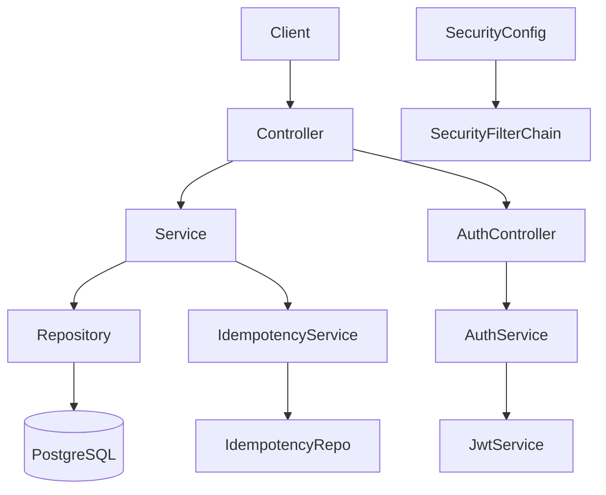

# LedgerCore

LedgerCore is a backend financial transaction management system built with Spring Boot. It provides user registration, account management, deposit/withdrawal/transfer operations, transaction tracking, idempotent request handling, reconciliation reporting, and JWT-based authentication. The project is built as a professional junior-level portfolio project demonstrating layered architecture, centralized exception handling, transactional consistency, and automated testing.

---

## Project Overview

LedgerCore manages core financial operations for registered users. Each user can have one or more customer accounts (plus a system-level account used for internal settlement). The application enforces ownership validation, account status checks, positive-amount validation, and idempotency on all transaction operations. It uses pessimistic write locking to protect concurrent balance updates and provides centralized exception handling through `@RestControllerAdvice`.

Major responsibilities:

*   User registration and profile management
*   Account creation, retrieval, and ownership validation
*   Deposit, withdrawal, and transfer transactions
*   Idempotent transaction processing
*   Transaction history with pagination and filtering
*   Reconciliation reporting (ledger balance vs account balance)
*   JWT authentication and authorization

---

## Features

### User Management
*   User creation (`POST /api/v1/auth/register`)
*   Profile retrieval (`GET /api/v1/users/me`)
*   Profile retrieval by account number (`GET /api/v1/users/me/{accountNumber}`)
*   User profile updates (`PATCH /api/v1/users/me`)
*   User status management (`ACTIVE`, `SUSPENDED`, `CLOSED`)

### Account Management
*   Default account creation on user registration
*   Additional account creation
*   Account retrieval by account number
*   List all accounts of user
*   Account ownership validation
*   Account status management (`ACTIVE`, `SUSPENDED`, `CLOSED`)

### Transactions
*   Deposit (`POST /api/v1/transactions/deposit`)
*   Withdrawal (`POST /api/v1/transactions/withdraw`)
*   Transfer (`POST /api/v1/transactions/transfer`)
*   Transaction history with pagination (`GET /api/v1/users/me/accounts/{accountNumber}/transactions`)
*   Filtering by `TransactionType` and `TransactionStatus`
*   Sorting by `createdAt` or `amount`
*   Balance validation on withdrawals and transfers
*   Ownership validation for source accounts
*   Positive-amount validation
*   Idempotency via `Idempotency-Key` header

### Reconciliation
*   Account reconciliation endpoint (`GET /api/v1/admin/reconciliation/accounts/{accountNumber}`)
*   Compares account balance to aggregated ledger entry totals
*   Reports difference and reconciliation status

### Security
*   JWT-based authentication (Spring Security OAuth2 Resource Server)
*   `BCrypt` password encoding
*   Stateless session management
*   Centralized authorization based on authenticated user identity

### Error Handling
*   Centralized exception handling (`GlobalExceptionHandler`)
*   Custom business exceptions (`ResourceDeniedException`, `InsufficientBalanceException`, `InvalidAmountException`, etc.)
*   Validation error responses with per-field details
*   Appropriate HTTP status codes (`400`, `403`, `404`, `409`, `422`, `500`)

---

## Tech Stack

| Technology | Purpose |
| :--- | :--- |
| Java 25 | Primary programming language |
| Spring Boot 4.1.1 | Application framework |
| Spring Web MVC | REST controllers and HTTP handling |
| Spring Data JPA | Persistence and repository layer |
| Hibernate | ORM and entity mapping |
| PostgreSQL | Relational database |
| Lombok | Boilerplate reduction |
| Spring Security | Authentication and authorization |
| Spring Security OAuth2 Resource Server | JWT token validation |
| Spring Validation | Request validation (`jakarta.validation`) |
| SpringDoc OpenAPI | API documentation / Swagger UI |
| Spring Boot Actuator | Health, metrics, info endpoints |
| Micrometer Prometheus | Metrics registry |
| Maven | Build and dependency management |
| JUnit 5 | Unit testing framework |
| Mockito | Mocking in unit tests |

---

## Architecture

LedgerCore follows a standard layered architecture:

```text
Client (HTTP / JWT)
  ↓
Controller Layer
  ↓
Service Layer
  ↓
Repository Layer
  ↓
PostgreSQL Database
```

### Controller Layer
Receives HTTP requests, validates request payloads with `@Valid`, extracts the `Authentication` principal, reads `Idempotency-Key` headers, and returns `ResponseEntity` responses.

### Service Layer
Contains all business logic, transaction rules, idempotency checks, balance updates, account status enforcement, and reconciliation calculations. Service methods are annotated with `@Transactional` where data consistency is required. Pessimistic write locks (`PESSIMISTIC_WRITE`) protect concurrent balance modifications.

### Repository Layer
Spring Data JPA repositories provide persistence access. Custom `@Lock` queries with `LockModeType.PESSIMISTIC_WRITE` are used for concurrent-safe balance updates.

### Entity Layer
JPA entities (`User`, `Account`, `FinancialTransaction`, `LedgerEntry`, `IdempotencyRecord`) map directly to database tables. Entities include business behavior methods (`credit`, `debit`, `complete`, `activate`, etc.).

### DTO Layer
Request/response DTOs separate API contracts from persistence entities and include validation annotations.

### Exception Layer
Custom exception classes and a global `@RestControllerAdvice` (`GlobalExceptionHandler`) provide centralized, consistent error responses.

### Security Layer
`SecurityConfig` configures `BCrypt` encoding, JWT encoding/decoding (`NimbusJwtEncoder` / `NimbusJwtDecoder`), stateless session management, and public/private endpoint rules.

---

## Architecture Diagram



---

## Project Structure

```text
src/
├── main/
│   ├── java/com/maheer9272/LedgerCore/
│   │   ├── LedgerCoreApplication.java
│   │   ├── config/
│   │   │   └── SecurityConfig.java
│   │   ├── controller/
│   │   │   ├── AccountController.java
│   │   │   ├── AuthController.java
│   │   │   ├── ReconciliationController.java
│   │   │   ├── TransactionController.java
│   │   │   └── UserController.java
│   │   ├── dto/
│   │   │   ├── AccountRequestDto.java
│   │   │   ├── AccountResponseDto.java
│   │   │   ├── CreateUserRequestDto.java
│   │   │   ├── CreateUserResponseDto.java
│   │   │   ├── DepositRequestDto.java
│   │   │   ├── ExceptionResponseDto.java
│   │   │   ├── LoginRequestDto.java
│   │   │   ├── LoginResponseDto.java
│   │   │   ├── ReconciliationResponseDto.java
│   │   │   ├── TransactionHistoryResponseDto.java
│   │   │   ├── TransferRequestDto.java
│   │   │   ├── TransferResponseDto.java
│   │   │   ├── TransactionResponseDto.java
│   │   │   ├── UserProfileResponse.java
│   │   │   ├── UserProfileResponseUsingAccountNumber.java
│   │   │   ├── UserUpdateRequestDto.java
│   │   │   ├── UserUpdateResponseDto.java
│   │   │   ├── ValidationExceptionResponseDto.java
│   │   │   └── WithdrawalRequestDto.java
│   │   ├── entity/
│   │   │   ├── Account.java
│   │   │   ├── AccountStatus.java
│   │   │   ├── AccountType.java
│   │   │   ├── CustomUserDetails.java
│   │   │   ├── FinancialTransaction.java
│   │   │   ├── IdempotencyRecord.java
│   │   │   ├── LedgerEntry.java
│   │   │   ├── LedgerEntryType.java
│   │   │   ├── TransactionStatus.java
│   │   │   ├── TransactionType.java
│   │   │   ├── User.java
│   │   │   └── UserStatus.java
│   │   ├── exception/
│   │   │   ├── AccountNotActiveException.java
│   │   │   ├── DuplicateResourceException.java
│   │   │   ├── GlobalExceptionHandler.java
│   │   │   ├── IdempotencyKeyConflictException.java
│   │   │   ├── InsufficientBalanceException.java
│   │   │   ├── InvalidAmountException.java
│   │   │   ├── InvalidSortFieldException.java
│   │   │   ├── InvalidTransactionRequestException.java
│   │   │   ├── InvalidTransactionStateException.java
│   │   │   ├── ResourceDeniedException.java
│   │   │   ├── ResourceNotFoundException.java
│   │   │   ├── SystemAccountNotFoundException.java
│   │   │   ├── TransactionNotBalancedException.java
│   │   │   └── UserNotActiveException.java
│   │   ├── mapper/
│   │   │   ├── AccountMapper.java
│   │   │   ├── TransactionMapper.java
│   │   │   └── UserMapper.java
│   │   ├── repository/
│   │   │   ├── AccountRepository.java
│   │   │   ├── FinancialTransactionRepository.java
│   │   │   ├── IdempotencyRecordRepository.java
│   │   │   ├── LedgerEntryRepository.java
│   │   │   └── UserRepository.java
│   │   └── service/
│   │       ├── AccountService.java
│   │       ├── AuthService.java
│   │       ├── CurrentUserResolver.java
│   │       ├── CustomUserDetailsService.java
│   │       ├── IdempotencyRecordService.java
│   │       ├── JwtService.java
│   │       ├── ReconciliationService.java
│   │       ├── TransactionHistorySpecification.java
│   │       ├── TransactionService.java
│   │       └── UserService.java
│   └── resources/
│       ├── application.properties
│       └── static/openapi.json
└── test/
    └── java/com/maheer9272/LedgerCore/
        ├── LedgerCoreApplicationTests.java
        ├── service/
        │   ├── AccountServiceTest.java
        │   ├── ReconciliationServiceTest.java
        │   ├── TransactionServiceTest.java
        │   └── UserServiceTest.java
```

---

## Domain Model / Database Design

### Entities

| Entity | Purpose                                                                                               |
| :--- |:------------------------------------------------------------------------------------------------------|
| `User` | Registered user with name, email, password, status, and timestamps                                    |
| `Account` | System account and customer account linked to a user; holds balance, status, type, and account number |
| `FinancialTransaction` | Transaction record (deposit, withdrawal, transfer) with reference ID, amount, status, description     |
| `LedgerEntry` | Double-entry bookkeeping record linking a transaction to an account (debit or credit)                 |
| `IdempotencyRecord` | Stores idempotency keys and request hashes for duplicate-request prevention                           |

### Key Relationships
*   `User` (1) → `Account` (*) — A user owns one or more customer accounts.
*   `Account` (1) → `LedgerEntry` (*) — Ledger entries reference an account.
*   `FinancialTransaction` (1) → `LedgerEntry` (*) — A transaction generates ledger entries.
*   `IdempotencyRecord` (1) → `FinancialTransaction` (1) — Each idempotency key links to a unique transaction.

### Important Design Notes
*   `Account.accountNumber` is a generated unique 8-character code.
*   `FinancialTransaction.referenceId` is a generated unique reference code.
*   `Account.balance` uses `BigDecimal` with 4 decimal scale (`precision = 19, scale = 4`).
*   `Account` uses `@Version` (`version` column) for optimistic locking (for future implementations if needed).
*   `Account` and `User` have protected constructors and business-level status-change methods (`activate`, `suspend`, `close`) rather than public setters.
*   System accounts (`AccountType.SYSTEM`) are used as settlement counterparts for customer transactions (deposit/withdrawal).

---

## API Documentation

### Authentication APIs

| Method | Endpoint | Description |
| :--- | :--- | :--- |
| POST | `/api/v1/auth/register` | Register a new user |
| POST | `/api/v1/auth/login` | Login and receive JWT token |

### User APIs

| Method | Endpoint | Description |
| :--- | :--- | :--- |
| GET | `/api/v1/users/me` | Get current user profile |
| GET | `/api/v1/users/me/{accountNumber}` | Get profile using account number |
| PATCH | `/api/v1/users/me` | Update user name and/or email |

### Account APIs

| Method | Endpoint | Description                           |
| :--- | :--- |:--------------------------------------|
| GET | `/api/v1/users/me/accounts` | List user's accounts                  |
| GET | `/api/v1/users/me/accounts/{accountNumber}` | Get account details by account number |
| POST | `/api/v1/users/me/accounts` | Create an additional account          |

### Transaction APIs

| Method | Endpoint | Description |
| :--- | :--- | :--- |
| POST | `/api/v1/transactions/deposit` | Deposit to user account |
| POST | `/api/v1/transactions/withdraw` | Withdraw from user account |
| POST | `/api/v1/transactions/transfer` | Transfer between customer accounts |

### Transaction History API

| Method | Endpoint | Description |
| :--- | :--- | :--- |
| GET | `/api/v1/users/me/accounts/{accountNumber}/transactions` | Paginated transaction history |

### Reconciliation API

| Method | Endpoint | Description |
| :--- | :--- | :--- |
| GET | `/api/v1/admin/reconciliation/accounts/{accountNumber}` | Reconciliation report |

---

## Important API Examples

### Register User
```http
POST /api/v1/auth/register
Content-Type: application/json
```
Request:
```json
{
  "name": "Alice Smith",
  "email": "alice@example.com",
  "password": "securePass123"
}
```
Response:
```json
{
  "name": "Alice Smith",
  "email": "alice@example.com",
  "accountNumber": "A1B2C3D4"
}
```

### Login
```http
POST /api/v1/auth/login
Content-Type: application/json
```
Request:
```json
{
  "email": "alice@example.com",
  "password": "securePass123"
}
```
Response:
```json
{
  "token": "<jwt_access_token>"
}
```

### Deposit
```http
POST /api/v1/transactions/deposit
Content-Type: application/json
Idempotency-Key: deposit-key-001
Authorization: Bearer <jwt_access_token>
```
Request:
```json
{
  "accountNumber": "A1B2C3D4",
  "amount": 500.00,
  "description": "Paycheck deposit"
}
```
Response:
```json
{
  "referenceId": "TRX-001",
  "transactionType": "DEPOSIT",
  "amount": 500.00,
  "status": "COMPLETED",
  "message": "Deposited the amount of 500.0 successfully"
}
```

### Withdrawal
```http
POST /api/v1/transactions/withdraw
Content-Type: application/json
Idempotency-Key: withdraw-key-002
Authorization: Bearer <jwt_access_token>
```
Request:
```json
{
  "accountNumber": "A1B2C3D4",
  "amount": 100.00,
  "description": "ATM withdrawal"
}
```

### Transfer
```http
POST /api/v1/transactions/transfer
Content-Type: application/json
Idempotency-Key: transfer-key-003
Authorization: Bearer <jwt_access_token>
```
Request:
```json
{
  "fromAccountNumber": "A1B2C3D4",
  "toAccountNumber": "E5F6G7H8",
  "amount": 250.00,
  "description": "Rent payment"
}
```
Response:
```json
{
  "referenceId": "TRX-003",
  "transactionType": "TRANSFER",
  "amount": 250.00,
  "status": "COMPLETED",
  "message": "Transferred the amount of 250.0 successfully"
}
```

---

## Business Rules

### User Rules
*   A user must have a unique email.
*   Email must be valid and between 1–50 characters.
*   Name must be 3–50 characters.
*   Password must be 8–25 characters.
*   User status changes through explicit methods (`activate`, `suspend`, `close`) rather than direct setters.

### Account Rules
*   Each user receives one `CUSTOMER` account on registration (`AccountType.CUSTOMER`).
*   Additional `CUSTOMER` accounts can be created.
*   System accounts (`AccountType.SYSTEM`) are used internally for settlement.
*   Account status changes through protected methods (`activate`, `suspend`, `close`).
*   Account number is an 8-character generated unique value.

### Transaction Rules

**All Transactions:**
*   Amount must be positive (`@Positive` on DTO; `InvalidAmountException` if `<= 0`).
*   User must have `ACTIVE` status (`UserNotActiveException` otherwise).
*   The `Idempotency-Key` header is required.
*   Duplicate keys with matching hashes return the existing transaction response.
*   Duplicate keys with mismatched hashes throw `IdempotencyKeyConflictException` (`409`).

**Deposit:**
*   Account must belong to the requesting user.
*   Account must be `ACTIVE` (`AccountNotActiveException` otherwise).
*   System account (`AccountType.SYSTEM`) must exist (`SystemAccountNotFoundException` otherwise).
*   User account is credited; system account is debited.

**Withdrawal:**
*   Source account must belong to the requesting user.
*   Source account must be `ACTIVE`.
*   Source account balance must cover the amount (`InsufficientBalanceException` otherwise).
*   User account is debited; system account is credited.

**Transfer:**
*   `fromAccountNumber` and `toAccountNumber` must not be the same (`InvalidTransactionRequestException`).
*   Source account must belong to the requesting user.
*   Both source and destination accounts must be `CUSTOMER` type (`InvalidTransactionRequestException` otherwise).
*   Both accounts must be `ACTIVE`.
*   Source account must have sufficient balance (`InsufficientBalanceException` otherwise).
*   Source account is debited; destination account is credited.
*   Concurrent updates are protected by pessimistic write locking based on lexicographic account number comparison (smaller number locked first).

---

## Transaction Management / Data Consistency

Transactional operations use Spring's `@Transactional` (from `jakarta.transaction`). Key patterns:

*   `TransactionService.deposit`, `.withdraw`, `.transfer` are fully transactional.
*   `AccountService.createDefaultAccount` and `.createAdditionalAccount` use `saveAndFlush` so the generated `accountNumber` is available immediately in the response.
*   Pessimistic write locks (`PESSIMISTIC_WRITE`) prevent concurrent balance modifications on the same account.
*   Transfer locks the accounts in lexicographic order to avoid deadlocks.
*   Financial transactions start in `PENDING` status and are completed (`COMPLETED`) only after ledger entries and balance updates succeed.
*   If any step fails, the transaction rolls back, ensuring no partial updates.

---

## Idempotency

LedgerCore implements idempotency for all transaction endpoints (`deposit`, `withdraw`, `transfer`) to prevent duplicate processing when clients retry requests.

*   Clients must provide an `Idempotency-Key` header (`String`).
*   The service generates a `SHA-256` hash of the request parameters (`IdempotencyRecordService`).
*   If the key exists and the hash matches, the original transaction response is returned without modifying balances.
*   If the key exists but the hash does not match, `IdempotencyKeyConflictException` (`409 Conflict`) is thrown.
*   The idempotency record links to the `FinancialTransaction`, ensuring consistent replay behavior.

---

## Validation

*   Request DTOs use Jakarta validation annotations (`@NotBlank`, `@NotNull`, `@Positive`, `@Size`, `@Email`).
*   The `GlobalExceptionHandler` catches `MethodArgumentNotValidException` and returns `ValidationExceptionResponseDto` with per-field error messages.
*   `ConstraintViolationException` (entity-level validation) is handled similarly.
*   `InvalidAmountException` is thrown explicitly in service logic for non-positive amounts.

---

## Error Handling

Errors are handled centrally by `GlobalExceptionHandler` (`@RestControllerAdvice`). Key response structures:

Standard error (`ExceptionResponseDto`):
```json
{
  "timeStamp": "2026-09-11T12:00:00",
  "statusCode": 400,
  "error": "Bad Request",
  "message": "Amount Must be positive",
  "path": "/api/v1/transactions/deposit"
}
```

Validation error (`ValidationExceptionResponseDto`):
```json
{
  "timeStamp": "2026-09-11T12:00:00",
  "statusCode": 400,
  "error": "Bad Request",
  "message": "Validation Failed",
  "path": "/api/v1/auth/register",
  "errors": {
    "email": "Email must be valid"
  }
}
```

Handled exceptions include:
*   `ResourceNotFoundException` → `404`
*   `DuplicateResourceException` → `409`
*   `UserNotActiveException` / `AccountNotActiveException` → `403`
*   `ResourceDeniedException` → `403`
*   `InsufficientBalanceException` → `422`
*   `InvalidTransactionRequestException` / `InvalidAmountException` / `InvalidSortFieldException` → `400`
*   `IdempotencyKeyConflictException` → `409`
*   `InvalidTransactionStateException` → `409`
*   `TransactionNotBalancedException` → `409`
*   `SystemAccountNotFoundException` → `500`
*   `ObjectOptimisticLockingFailureException` → `409`
*   `MethodArgumentNotValidException` / `ConstraintViolationException` → `400`
*   `DataIntegrityViolationException` → `409`

---

## Authentication and Authorization

*   **Mechanism:** JWT (`spring-boot-starter-security-oauth2-resource-server`).
*   **Encoding:** `BCrypt` (`PasswordEncoder`).
*   **Token generation:** `JwtService` creates signed JWT tokens (`NimbusJwtEncoder`) using `jwt.secret` and `jwt.issuer`. Token expiry is configured in `application.properties` (`jwt.expiry` in seconds).
*   **Token validation:** `NimbusJwtDecoder` validates tokens against the configured issuer (`jwt.issuer`).
*   **Public endpoints:** `/api/v1/auth/register`, `/api/v1/auth/login`, `/openapi.json`, `/api_docs/**`, `/swagger-ui/**`, `/v3/api-docs/**`
*   **Protected endpoints:** All other endpoints require a valid `Authorization: Bearer <token>` header.
*   **User identity:** `CurrentUserResolver` resolves the `User` entity from the JWT `subject` (email) using `UserRepository.findByEmail`.
*   **Ownership checks:** Controllers pass `Authentication` to services; services validate that the requesting user owns the account or transaction being accessed.
*   **Roles:** The current implementation uses a single user role (no role-based authorization).  `CustomUserDetails.getAuthorities()` returns an empty list. In future roles will be introduced.

---

## Testing

Testing uses **JUnit 5** with **Mockito** (`MockitoExtension`). All service-layer tests are pure unit tests (no actual database or HTTP server). There are **no integration tests** or **Testcontainers** in the current codebase.

### Test Coverage by Service

#### `TransactionServiceTest`
*   Successful deposit, withdrawal, and transfer
*   Rejection when user is not active (`UserNotActiveException`)
*   Rejection when source account does not belong to user (`ResourceDeniedException`)
*   Rejection for same-account transfer (`InvalidTransactionRequestException`)
*   Rejection for insufficient balance (`InsufficientBalanceException`)
*   Idempotency key reuse with matching hash (returns original response)
*   Idempotency key conflict (different request hash) (`IdempotencyKeyConflictException`)

#### `UserServiceTest`
*   Profile retrieval by account number
*   Profile retrieval by current user
*   Profile update (name, email, both)
*   Rejection when both fields are null (`IllegalArgumentException`)
*   Rejection when email already exists (`DuplicateResourceException`)
*   Rejection when account does not belong to user (`ResourceDeniedException`)

#### `AccountServiceTest`
*   Default account creation
*   Additional account creation
*   Account retrieval by account number
*   Account retrieval rejection for non-owned account
*   List all accounts (including empty list)

#### `ReconciliationServiceTest`
*   Balanced account reconciliation (`reconciled = true`, difference = 0)
*   Mismatched balance (`reconciled = false`, non-zero difference)
*   Account with no ledger entries

---

## Test Results

Run the test suite with:
```bash
mvn test
```

The project includes automated unit tests for all major services. No test failures are expected from the current test suite. No test coverage report is configured in the current build.

---

## How to Run the Project

### Prerequisites
*   Java 25 (as configured in `pom.xml`)
*   Maven 3.9+
*   PostgreSQL database
*   A JWT secret and issuer configured in `application.properties`

### Clone
```bash
git clone <repository-url>
cd LedgerCore
```

### Database Setup
Create a PostgreSQL database named `fintech_project_db` (or adjust `spring.datasource.url` in `application.properties`). The database uses `postgres` as the default user.

> **Note:** The `application.properties` contains placeholder-level database connection details and JWT configuration for local development. Update these with your own database and secret values before running.

### Configuration
Review and update `src/main/resources/application.properties`:
```properties
spring.datasource.url=jdbc:postgresql://localhost:5432/fintech_project_perf_testing_db
spring.datasource.username=postgres
spring.datasource.password=<your_password>

jwt.secret=<your_base64_encoded_secret>
jwt.issuer=<your_issuer>
jwt.expiry=604800
```

### Run
```bash
mvn clean install
mvn spring-boot:run
```

### Test
```bash
mvn test
```

---

## API Documentation / Swagger

Swagger UI is configured via `springdoc-openapi-starter-webmvc-ui` and available at:
```text
<Base_URL>/api_docs
```

The OpenAPI spec file (`openapi.json`) is served at:
```text
<Base_URL>/openapi.json
```

---

## Example Workflow

```text
Client
  ↓ POST /api/v1/auth/register
AuthController
  ↓ AuthService
User + Default Account created (DB + Ledger)
  ↓ Response: user + accountNumber

Client (authenticated)
  ↓ POST /api/v1/transactions/deposit
  Headers: Authorization: Bearer <token>, Idempotency-Key: key-001
TransactionController
  ↓ Request validation (@Valid)
TransactionService
  ↓ Resolve current user (CurrentUserResolver)
  ↓ Check user status (ACTIVE)
  ↓ Check account ownership + status (ACTIVE)
  ↓ Check idempotency key (IdempotencyRecordService / SHA-256 hash)
  ↓ Create FinancialTransaction (PENDING)
  ↓ Create LedgerEntry (DEBIT system, CREDIT user)
  ↓ Update balances (PESSIMISTIC_WRITE locks)
  ↓ Save IdempotencyRecord
  ↓ Complete transaction (COMPLETED)
Response: TransactionResponseDto
```

---

## Development Practices

*   **Layered architecture** with clear separation of controllers, services, repositories, entities, DTOs, and exceptions.
*   **DTO-based API design** separates request/response contracts from JPA entities.
*   **Centralized exception handling** via `@RestControllerAdvice` with consistent response structures.
*   **Business validation** enforced in the service layer, not just at the controller level.
*   **Idempotency mechanism** using SHA-256 hashes for safe retry behavior on financial operations.
*   **Pessimistic locking** for concurrent-safe balance updates.
*   **Unit testing** with JUnit 5 and Mockito covering service-level business rules, exception scenarios, and idempotency behavior.
*   **Git version control** with feature/fix branch workflow (`testing_branch`).
*   **Swagger/OpenAPI** documentation configured for API exploration.
*   **Spring Boot Actuator** endpoints for basic health and metrics monitoring.

---

## Future Improvements

*   JWT authentication is implemented; role-based authorization (`ROLE_USER`, etc.) is not fully utilized.
*   Integration tests (`@SpringBootTest`, `Testcontainers`) are not implemented.
*   Docker and containerization are not configured.
*   CI/CD pipeline (GitHub Actions) is not configured.
*   Pagination and advanced filtering could be extended further.
*   Audit logging and transaction-level audit trails are not implemented.
*   Advanced concurrency improvements (e.g., distributed locks) are not implemented.
*   Monitoring dashboards and alerting beyond Actuator metrics are not configured.
*   Multi-currency support is not implemented.

---

## Project Status

Active development. Core user, account, and transaction functionality is implemented and covered by automated unit tests. The codebase demonstrates sound software engineering practices at a professional junior/fresher developer level, including layered architecture, validation, centralized exception handling, idempotency, transactional consistency, and JWT authentication.

---

## License

No license file is present in the repository. Consider adding an open-source license (e.g., MIT or Apache 2.0) if you intend to share this project publicly.

---

## Information That Could Not Be Determined

*   The exact repository URL (`git clone` reference) was not available in the inspected files.
*   No `Dockerfile`, `docker-compose.yml`, or Kubernetes manifests exist in the repository.
*   No GitHub Actions workflow files (`.github/workflows/`) exist in the repository.
*   No `README.md` existed prior to this creation; therefore, previous documentation state could not be verified.
*   The exact database schema creation script (Flyway, Liquibase, or manual SQL) was not found in the repository; only `spring.jpa.hibernate.ddl-auto=update` is configured.
